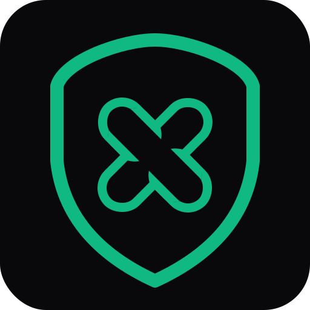
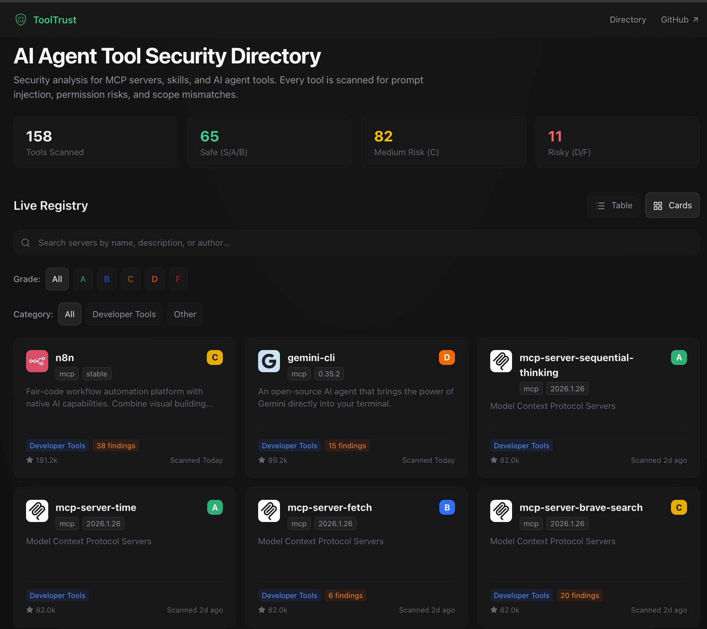

<p align="center">
  
</p>

<h1 align="center">ToolTrust Scanner</h1>

<p align="center">
  <strong>We scanned 207 MCP servers. 70% have security issues.</strong><br/>
  Your AI agent trusts them all.
</p>

<p align="center">
  <a href="https://github.com/AgentSafe-AI/tooltrust-scanner/actions/workflows/ci.yml"></a>
  <a href="https://github.com/AgentSafe-AI/tooltrust-scanner/actions/workflows/security.yml"></a>
  <a href="https://goreportcard.com/report/github.com/AgentSafe-AI/tooltrust-scanner"></a>
  <a href="LICENSE"></a>
  <a href="https://github.com/AgentSafe-AI/tooltrust-scanner/stargazers"></a>
</p>

---

Every MCP tool your agent calls is an attack surface — prompt injection, data exfiltration, privilege escalation, supply-chain backdoors. ToolTrust scans tool definitions *before* your agent trusts them and assigns a trust grade (A–F) so you know the risk.


## Scan your setup in 30 seconds

Add ToolTrust as an MCP server and let your agent audit its own tools:

```json
{
  "mcpServers": {
    "tooltrust": {
      "command": "npx",
      "args": ["-y", "tooltrust-mcp"]
    }
  }
}
```

Then ask your agent: *"Run tooltrust_scan_config"*

It reads your MCP config, connects to each server in parallel, scans every tool, and returns a risk report with grades and enforcement decisions — all in seconds.

Or use the CLI:

```bash
curl -sfL https://raw.githubusercontent.com/AgentSafe-AI/tooltrust-scanner/main/install.sh | bash
tooltrust-scanner scan --server "npx -y @modelcontextprotocol/server-filesystem /tmp"
```

## What we found scanning 207 servers

| Metric | Count |
|--------|-------|
| MCP servers scanned | 207 |
| Individual tools analyzed | 3,235 |
| Total security findings | 3,613 |
| Servers with at least one finding | 145 (70%) |
| Servers with a clean Grade A | 22 (10%) |
| Critical findings (arbitrary code execution) | 16 |

**Only 10% of MCP servers get a clean bill of health.** [Read the full analysis →](docs/blog-post-draft.md)

## What it catches

ToolTrust runs 13 static analysis rules against every tool definition:

| Threat | Rule | What it detects |
|--------|------|-----------------|
| Prompt injection | AS-001 | Malicious instructions hidden in tool descriptions that hijack agent reasoning |
| Excessive permissions | AS-002 | Tools requesting `exec`, `network`, `db`, or `fs` access beyond their stated purpose |
| Scope mismatch | AS-003 | Tool names that contradict their actual permissions |
| Supply-chain CVEs | AS-004 | Known vulnerabilities via the OSV database |
| Privilege escalation | AS-005 | Tools requesting `admin`, `root`, or `sudo` scopes |
| Arbitrary code execution | AS-006 | Tools that can run arbitrary scripts or shell commands on your machine |
| Missing metadata | AS-007 | Tools with no description or input schema |
| Known malware | AS-008 | Confirmed compromised package versions (offline blacklist) |
| Typosquatting | AS-009 | Tool names that impersonate legitimate tools via edit-distance |
| Secret leakage | AS-010 | Tools accepting API keys or passwords as plaintext input parameters |
| Missing rate limits | AS-011 | Tools with no timeout or rate-limit configuration |
| Tool shadowing | AS-013 | Duplicate tool names designed to hijack agent behavior |

Full rule details: [docs/RULES.md](docs/RULES.md)

## How it works

1. **Parse** — Connects to a live MCP server (or reads a JSON file) and extracts every tool definition
2. **Analyze** — Runs all 13 rules against each tool's name, description, schema, and permissions
3. **Grade** — Assigns a numeric risk score and letter grade (A–F) per tool
4. **Enforce** — Maps each grade to a gateway policy: `ALLOW`, `REQUIRE_APPROVAL`, or `BLOCK`

Pure static analysis. No LLM calls. No data leaves your machine (except optional CVE lookups). Runs in milliseconds. Deterministic and reproducible.

## Browse the directory



Look up any MCP server's trust grade before you install it: **[tooltrust.dev](https://www.tooltrust.dev/)**

## Install

```bash
# One-line install (macOS / Linux)
curl -sfL https://raw.githubusercontent.com/AgentSafe-AI/tooltrust-scanner/main/install.sh | bash

# Go
go install github.com/AgentSafe-AI/tooltrust-scanner/cmd/tooltrust-scanner@latest

# Homebrew
brew install AgentSafe-AI/tap/tooltrust-scanner

# npx (no install needed)
npx -y tooltrust-mcp
```

## MCP tools

When running as an MCP server, ToolTrust exposes these tools to your agent:

| Tool | What it does |
|------|-------------|
| `tooltrust_scan_config` | Scan all MCP servers in your `.mcp.json` or `~/.claude.json` |
| `tooltrust_scan_server` | Launch and scan a specific MCP server by command |
| `tooltrust_scanner_scan` | Scan a raw JSON blob of tool definitions |
| `tooltrust_lookup` | Look up a server's trust grade from the ToolTrust Directory |
| `tooltrust_list_rules` | List all built-in security rules |

## CI / GitHub Actions

Block risky MCP servers in your pipeline:

```yaml
- name: Audit MCP Server
  uses: AgentSafe-AI/tooltrust-scanner@main
  with:
    server: "npx -y @modelcontextprotocol/server-filesystem /tmp"
    fail-on: "approval"
```

## Scan-before-install gate

Never add an untrusted MCP server to your config again:

```bash
# Scans the server, then auto-installs if Grade A/B, prompts on C/D, blocks on F
tooltrust-scanner gate @modelcontextprotocol/server-memory -- /tmp

# Replace `claude mcp add` with a scanned install
alias mcp-add='tooltrust-scanner gate'
```

Full gate options and pre-commit hook setup: [docs/USAGE.md](docs/USAGE.md)

## Add a trust badge to your project

If your MCP server passes ToolTrust, let people know:

```markdown
[](https://www.tooltrust.dev/)
```

> [](https://www.tooltrust.dev/)

---

> **Supply-chain alert:** ToolTrust detects and blocks confirmed compromised packages including LiteLLM v1.82.7/8 (TeamPCP backdoor), Trivy v0.69.4–v0.69.6, and Langflow < 1.9.0. If you encounter a Grade F with rule AS-008, remove the package immediately and rotate all credentials.

---

[Usage guide](docs/USAGE.md) · [Developer guide](docs/DEVELOPER.md) · [Contributing](docs/CONTRIBUTING.md) · [Changelog](CHANGELOG.md) · [Security](docs/SECURITY.md) · [License: MIT](LICENSE)

© 2026 [AgentSafe AI](https://github.com/AgentSafe-AI)
