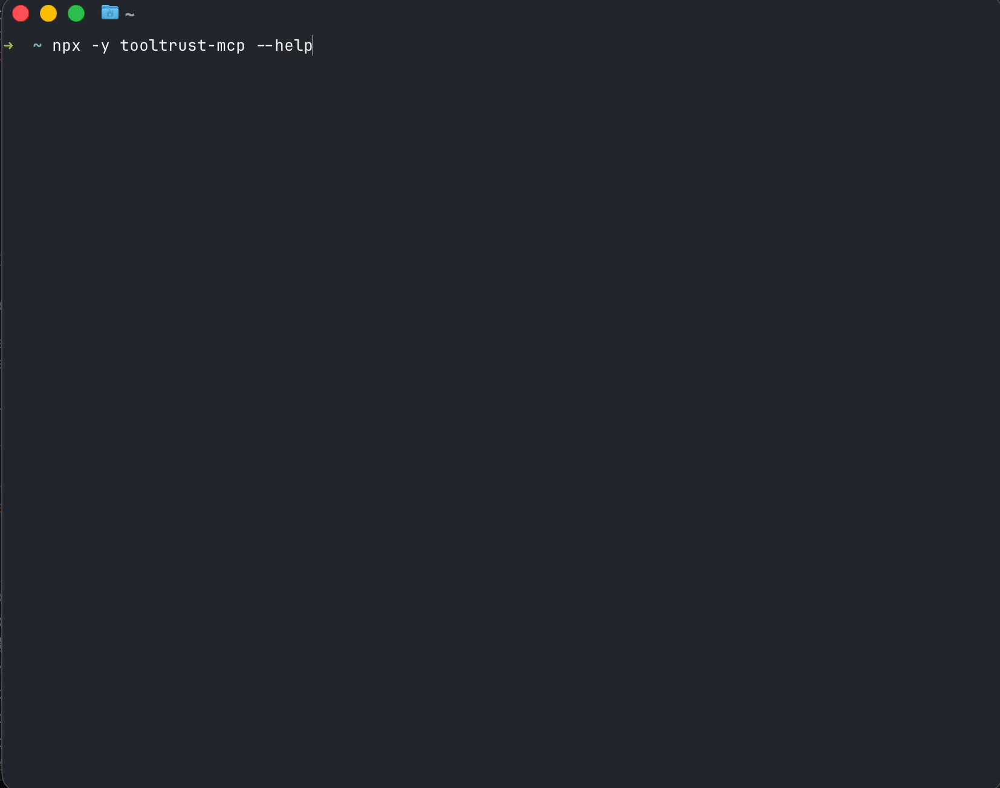

# ToolTrust Scanner

[](https://github.com/AgentSafe-AI/tooltrust-scanner/actions/workflows/ci.yml)
[](https://github.com/AgentSafe-AI/tooltrust-scanner/actions/workflows/security.yml)
[](https://github.com/AgentSafe-AI/tooltrust-scanner/stargazers)
[](https://goreportcard.com/report/github.com/AgentSafe-AI/tooltrust-scanner)
[](LICENSE)

**Scan MCP servers for prompt injection, data exfiltration, and privilege escalation before your AI agent blindly trusts them.**

> **🚨 Urgent Security Update (March 24, 2026)**
> ToolTrust now detects and blocks the LiteLLM / TeamPCP supply chain exploit. If you are adding MCP servers that rely on litellm (v1.82.7/8), ToolTrust will trigger a CRITICAL Grade F warning and block installation to protect your SSH/AWS keys.


## 🤖 Let your AI agent scan its own tools

Add ToolTrust as an MCP server in your `.mcp.json` and your agent can audit every tool it has access to:

```json
{
  "mcpServers": {
    "tooltrust": {
      "command": "npx",
      "args": ["-y", "tooltrust-mcp"]
    }
  }
}
```

Then ask your agent to run `tooltrust_scan_config` — it reads your MCP config and scans all servers in parallel.

| Tool | Description |
|------|-------------|
| `tooltrust_scan_config` | Scan all servers in your `.mcp.json` or `~/.claude.json` in parallel |
| `tooltrust_scan_server` | Launch and scan a specific MCP server |
| `tooltrust_scanner_scan` | Scan a JSON blob of tool definitions |
| `tooltrust_lookup` | Look up a server's trust grade from the [ToolTrust Directory](https://www.tooltrust.dev) |
| `tooltrust_list_rules` | List all 12 security rules with IDs and descriptions |

## 💻 CLI



```bash
# Install
curl -sfL https://raw.githubusercontent.com/AgentSafe-AI/tooltrust-scanner/main/install.sh | bash

# Scan any MCP server
tooltrust-scanner scan --server "npx -y @modelcontextprotocol/server-filesystem /tmp"

# Scan-then-install: gate checks a server before adding it to your config
tooltrust-scanner gate @modelcontextprotocol/server-memory -- /tmp
```

<details>
<summary>Other install methods</summary>

```bash
# Go install
go install github.com/AgentSafe-AI/tooltrust-scanner/cmd/tooltrust-scanner@latest

# Homebrew
brew install AgentSafe-AI/tap/tooltrust-scanner

# Specific version
curl -sfL https://raw.githubusercontent.com/AgentSafe-AI/tooltrust-scanner/main/install.sh | VERSION=vX.Y.Z bash
```
</details>

## 🚪 Gate: scan-before-install

`tooltrust-scanner gate` scans an MCP server **before** installing it. Grade A/B auto-installs, C/D prompts for confirmation, F blocks entirely.

```bash
# Scan and install if safe (writes .mcp.json)
tooltrust-scanner gate @modelcontextprotocol/server-memory -- /tmp

# Dry run — scan only, don't install
tooltrust-scanner gate --dry-run @modelcontextprotocol/server-filesystem -- /tmp

# Block anything below grade B
tooltrust-scanner gate --block-on B @some/package

# Install to user config (~/.claude.json) instead of project
tooltrust-scanner gate --scope user @some/package

# Override the server name in config
tooltrust-scanner gate --name my-server @some/package

# Force install regardless of grade (with warning)
tooltrust-scanner gate --force @some/package
```

| Flag | Default | Description |
|------|---------|-------------|
| `--name` | derived from package | Server name in config |
| `--dry-run` | `false` | Scan only, don't install |
| `--block-on` | `F` | Minimum grade that blocks: `F`, `D`, `C`, `B` |
| `--scope` | `project` | `project` (`.mcp.json`) or `user` (`~/.claude.json`) |
| `--force` | `false` | Bypass grade check |
| `--deep-scan` | `false` | Enable AI-based semantic analysis |
| `--rules-dir` | built-in | Custom YAML rules directory |

**Exit codes:** `0` = installed (or dry-run), `1` = blocked by policy, `2` = error.

## 🔗 Pre-Hook Integration

### Shell alias

Replace `claude mcp add` with `tooltrust-scanner gate` so every install is scanned first:

```bash
alias mcp-add='tooltrust-scanner gate'
# mcp-add @modelcontextprotocol/server-memory -- /tmp
```

### Git pre-commit hook

If `.mcp.json` is checked into your repo, scan it on every commit:

```bash
# .git/hooks/pre-commit
#!/bin/sh
if git diff --cached --name-only | grep -q '\.mcp\.json'; then
  tooltrust-scanner scan --input .mcp.json --fail-on block || exit 1
fi
```

## 🔍 What it catches

| ID | Severity | Detects |
|----|:--------:|---------|
| **AS-001** | Critical | Prompt poisoning / injection in tool descriptions |
| **AS-002** | High/Low | Excessive permissions (`exec`, `network`, `db`, `fs`) |
| **AS-003** | High | Scope mismatch (name contradicts permissions) |
| **AS-004** | High/Crit | Supply chain CVEs via [OSV](https://osv.dev) |
| **AS-005** | High | Privilege escalation (`admin` scopes, `sudo`) |
| **AS-006** | Critical | Arbitrary code execution |
| **AS-007** | Info | Missing description or schema |
| **AS-008** | **Critical** | **Known-compromised package versions** — offline blacklist (TeamPCP/litellm, trivy, langflow) with zero latency |
| **AS-009** | Medium | Typosquatting (edit-distance impersonation) |
| **AS-010** | Medium | Insecure secret handling in params |
| **AS-011** | Low | Missing rate-limits or timeouts |
| **AS-013** | High/Med | Tool shadowing (duplicate name hijacking) |

## 🤝 GitHub Actions

```yaml
- name: Audit MCP Server
  uses: AgentSafe-AI/tooltrust-scanner@main
  with:
    server: "npx -y @modelcontextprotocol/server-filesystem /tmp"
    fail-on: "approval"
```

---

[Developer guide](docs/DEVELOPER.md) · [Contributing](docs/CONTRIBUTING.md) · [Changelog](CHANGELOG.md) · [Security](docs/SECURITY.md) · [License: MIT](LICENSE) © 2026 AgentSafe-AI

## Feedback

Found a false positive? A tool that should be flagged but isn't?

| | |
|---|---|
| [Report false positive](https://github.com/AgentSafe-AI/tooltrust-scanner/issues/new?template=false-positive.yml&labels=false-positive) | A tool was flagged but shouldn't be |
| [Report missed detection](https://github.com/AgentSafe-AI/tooltrust-scanner/issues/new?template=missed-detection.yml&labels=missed-detection) | A tool should have been flagged |
| [File a bug](https://github.com/AgentSafe-AI/tooltrust-scanner/issues/new?template=bug-report.yml&labels=bug) | Something is broken |
